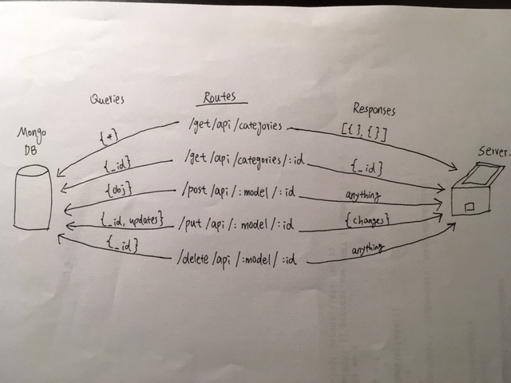

# LAB - 09

## API Server

### Author: David Zheng 

### Links and Resources
* [submission PR](https://github.com/davidzheng-401d32/lab-09/pull/1)
* [travis](https://travis-ci.com/davidzheng-401d32/lab-09/builds/133499570)
* [back-end]Will update Heroku link when there is more progress on the lab. 
* [front-end](http://xyz.com) (when applicable)

#### Documentation
* Having issues with server and mongoDB, will update JSDOC and Swagger docs once I make more progress. 

  
#### Tests
* Unit Test: `npm test`
* Lint Test: `npm run lint`

#### UML
